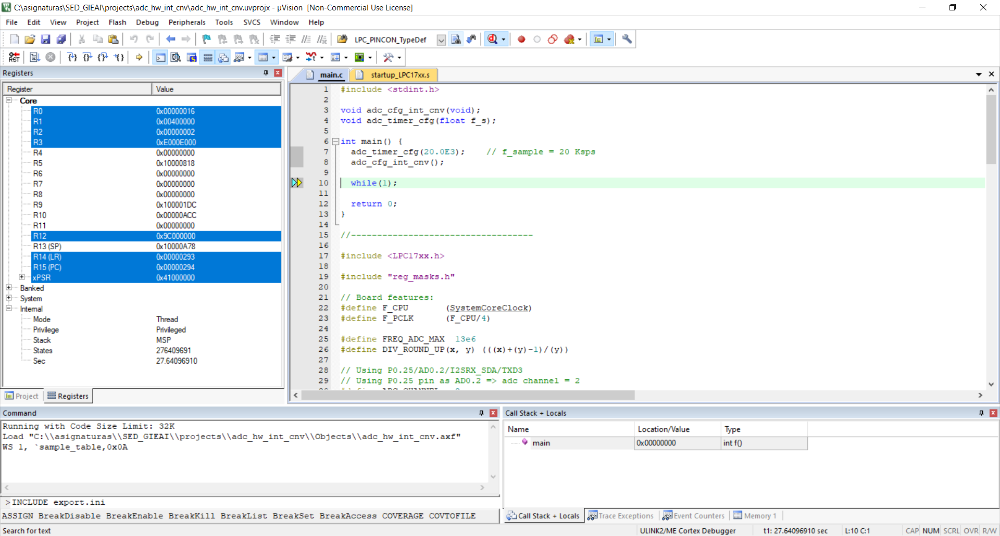
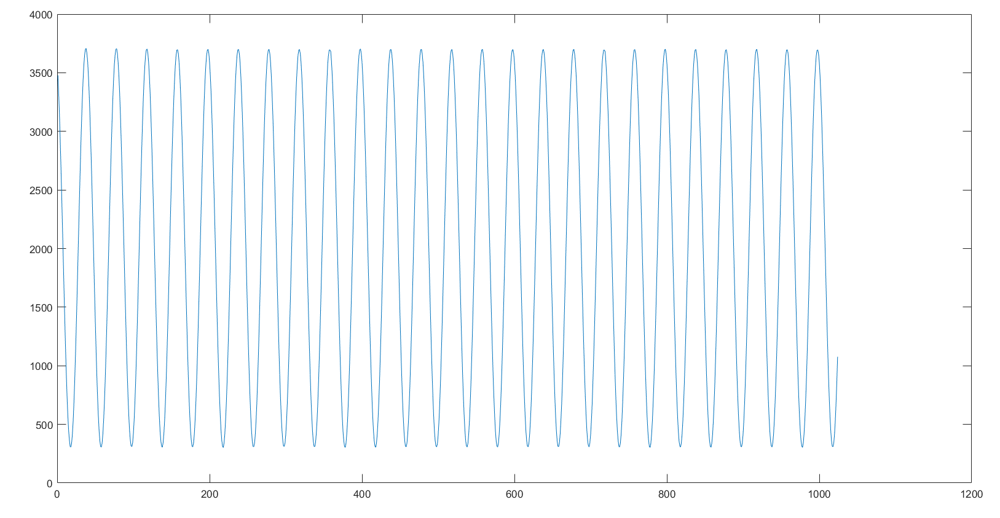

# adc_hw_int_cnv

Este es un ejemplo del uso del módulo ADC con control de conversión por HW utilizando una señal interna (timer) como fuente de solicitud de conversión.

## Exportación a Matlab la señal adquirida 

Para exportar a Matlab la señal adquirida se puede seguir el procedimiento que se describe a continuación. 

La idea consiste en almacenar en un buffer de memoria la traza de muestras que se desea exportar. Esto se hace desde la rutina de tratamiento de interrupción del ADC.

```C
#define ACQ_BUF_LEN 1024
uint16_t acq_buffer[ACQ_BUF_LEN];
int acq_idx = 0;

volatile int16_t sample;
void ADC_IRQHandler() {
  uint32_t reg;
  // Reading the ADGDR clears the interrupt flag:
  reg = LPC_ADC->ADGDR;
  sample = ADC_GET_RESULT(reg);
  if (acq_idx < ACQ_BUF_LEN) {
    acq_buffer[acq_idx++] = sample;
  }
}
```

Una vez compilada la aplicación, se descarga en la tarjeta Mini-DK2 y se ejecuta en modo continuo. Transcurrido un breve tiempo el buffer `acq_buffer` se habrá llenado con las primeras `ACQ_BUF_LEN` muestras.

A continuación, detendremos la ejecución de la aplicación y procederemos a volcar al disco duro de nuestro ordenador el contenido del buffer `acq_buffer` utilizando para ello las capacidades de depuración del entorno Keil. Para ello se utilizará el comando **`SAVE`** de Keil:

```
SAVE path\fname startAddr, endAddr 
```

que permite volcar sobre el fichero `fname`el contenido del bloque de memoria comprendido entre `startAddr` y `endAddr` . El fichero generado utiliza el formato HEX386. Para automatizar el proceso de volcado del buffer se utilizará el script denominado `export.ini` incluido en el directorio del proyecto.

La carga de este script y la posterior ejecución se realiza a través de la la ventana de comandos de Keil, tal y como se muestra en la siguiente figura.




Concretamente, se han de ejecutar los siguientes comandos:

```
INCLUDE export.ini
export_adc_buffer() 
```
obteniéndose el siguiente mensaje


```
Execute from Matlab the next command:
x = hex386_to_bin('../adc_hw_int_cnv/acq_download.hex', '0x10000018', '0x10000817');
```
### Importar desde Matlab los datos descargados

Dado que el formato HEX386 no es directamente importable desde Matlab utilizaremos las utilidades **SRecord**, que se pueden descargar de https://sourceforge.net/projects/srecord/. Una vez conectados a esa página web, en la pestaña Files, se ha de descargar la última versión para Win32 (srecord-win32). De los distintos formatos ofrecidos (.zip, .exe y tar.gz), descargar el .zip y descomprimirlo en un directorio. En nuestro caso este directorio es:

```
C:/asignaturas/SED_GIEAI/projects/utils
```

A continuación abrir Matlab y cambiar al directorio matlab del repositorio. Desde allí, tal y como se indica en la consola de Keil, ejecutar el comando:

```
x = hex386_to_bin('../adc_hw_int_cnv/acq_download.hex', '0x10000018', '0x10000817');
```

Tras ejecutar este comando la variable `x` contiene la señal adquirida desde la tarjeta Mini-DK2, pudiendo ser representada en Matlab:




